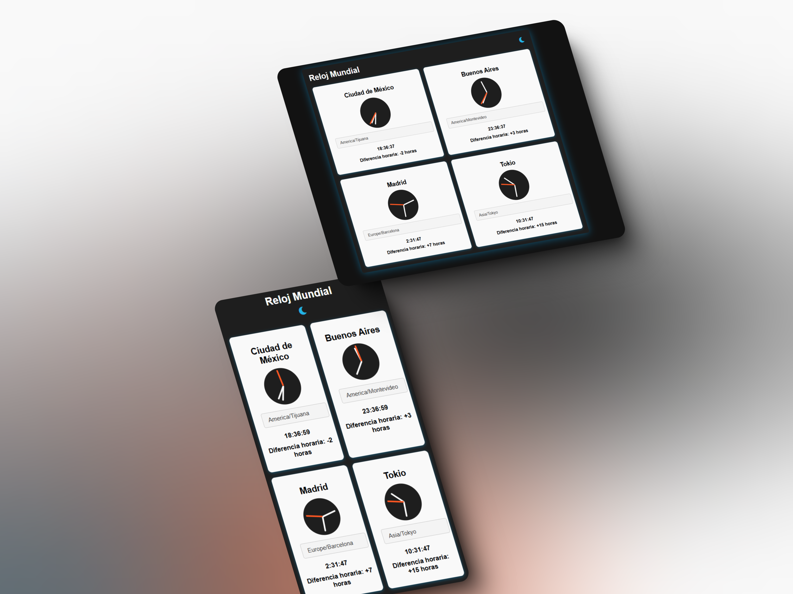

# Reloj Digital y Analógico con Soporte para Diferentes Zonas Horarias

 

Este proyecto implementa un reloj digital y analógico que muestra la hora en diferentes zonas horarias. Los relojes se actualizan en tiempo real y el usuario puede elegir la zona horaria de cada ciudad. Además, la aplicación permite alternar entre un modo claro y oscuro.

## Funcionalidades

- **Modo Oscuro**: Cambia entre el modo claro y el modo oscuro para una mejor experiencia de usuario.
- **Reloj Digital**: Muestra la hora en formato digital de varias ciudades del mundo.
- **Reloj Analógico**: Un reloj analógico que se actualiza cada segundo para reflejar la hora actual en la ciudad seleccionada.
- **Diferencia Horaria**: Muestra la diferencia horaria entre la ciudad seleccionada y la hora local del usuario.

## Tecnologías Utilizadas

- HTML5
- CSS3
- JavaScript (ES6+)
- Manipulación de DOM con `setInterval` para actualizar los relojes en tiempo real.
- Uso de `Intl.DateTimeFormat` para manejar zonas horarias de manera eficiente.
